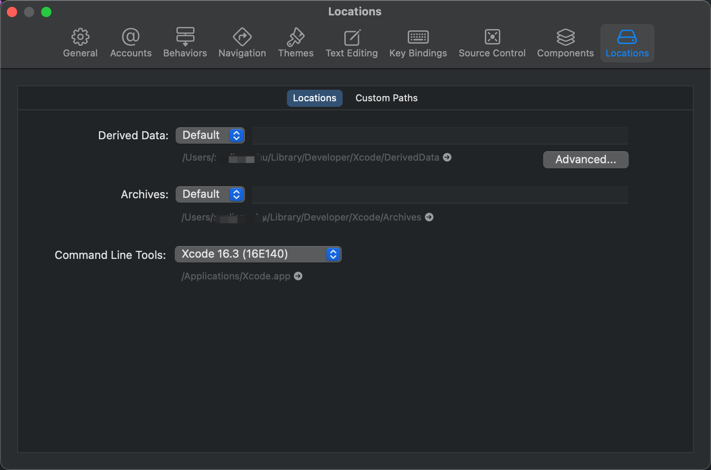
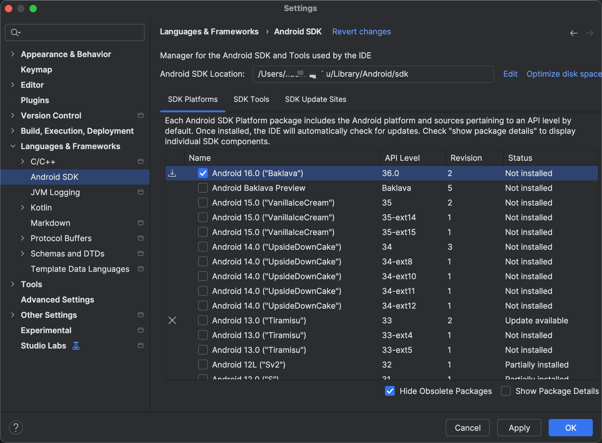
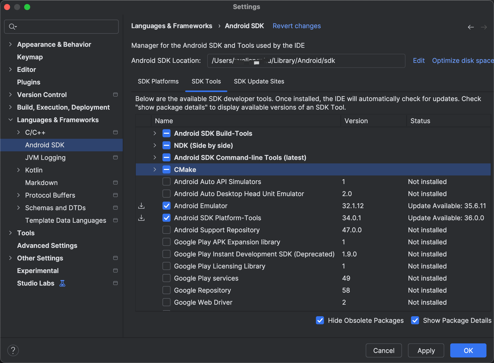
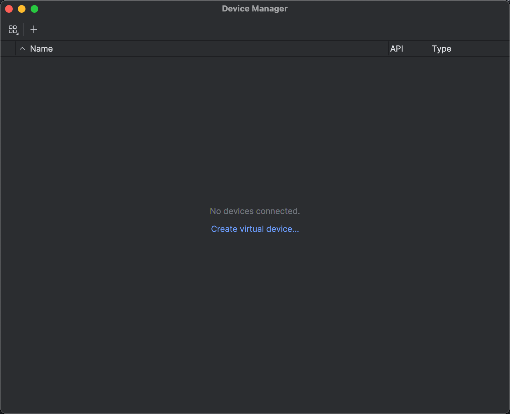
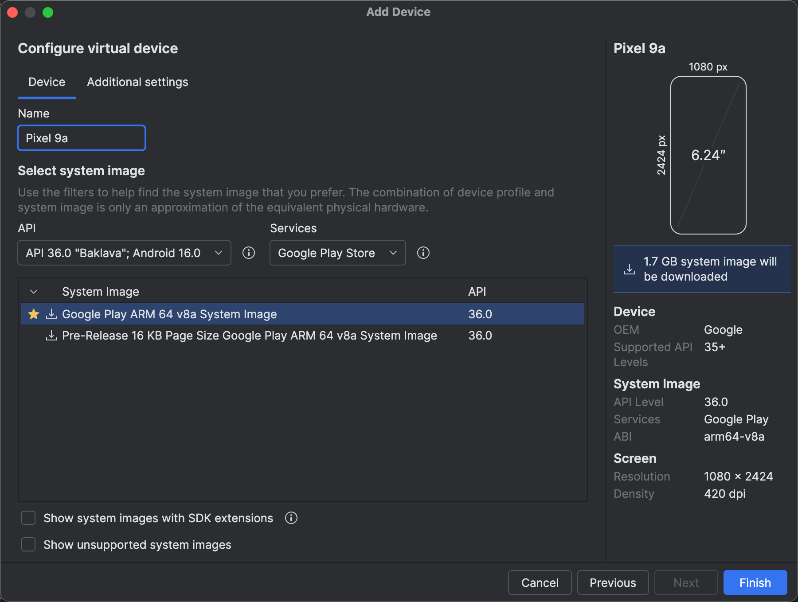

# Welcome to your Scaffold Stark React Native 👋

This is an [Expo](https://expo.dev) project created with [`create-expo-app`](https://www.npmjs.com/package/create-expo-app).

## Prepare environment

### iOS simulator

1. Install Xcode
   Open up the Mac App Store, search for [Xcode](https://apps.apple.com/us/app/xcode/id497799835), and click Install (or Update if you have it already).

2. Install Xcode Command Line Tools
   Open Xcode, choose Settings... from the Xcode menu (or press cmd ⌘ + ,). Go to the Locations and install the tools by selecting the most recent version in the Command Line Tools dropdown.

   

3. Install an iOS Simulator in Xcode
   To install an iOS Simulator, open Xcode > Settings... > Components, and under Platform Support > iOS ..., click Get.

4. Install Watchman
   [Watchman](https://facebook.github.io/watchman/docs/install#macos) is a tool for watching changes in the filesystem. Installing it will result in better performance. You can install it with:

   ```
   brew update
   brew install watchman
   ```

### Android Emulator

1. Download and install [Android Studio](https://developer.android.com/studio).

2. Open the Android Studio app, click More Actions and select SDK Manager.

3. Open Android Studio, go to Settings > Languages & Frameworks > Android SDK. From the SDK Platforms tab, select the latest Android version (API level).



Then, click on the SDK Tools tab and make sure you have at least one version of the Android SDK Build-Tools and Android Emulator installed.



4. Copy or remember the path listed in the box that says Android SDK Location.

5. Click Apply and OK to install the Android SDK and related build tools.

6. If you are on macOS or Linux, add an environment variable pointing to the Android SDK location in ~/.bash_profile (or ~/.zshrc if you use Zsh). For example: export ANDROID_HOME=/your/path/here.
   Add the following lines to your /.zprofile or ~/.zshrc (if you are using bash, then ~/.bash_profile or ~/.bashrc) config file:

```
export ANDROID_HOME=$HOME/Library/Android/sdk
export PATH=$PATH:$ANDROID_HOME/emulator
export PATH=$PATH:$ANDROID_HOME/platform-tools
```

7. Reload the path environment variables in your current shell:

```
# for zsh
source $HOME/.zshrc

# for bash
source $HOME/.bashrc
```

### Set up an emulator

1. On the Android Studio main screen, click More Actions, then Virtual Device Manager in the dropdown.

2. Click the Create device button.

   

3. Under Select Hardware, choose the type of hardware you'd like to emulate. We recommend testing against a variety of devices, but if you're unsure where to start, the newest device in the Pixel line could be a good choice.



### Install Expo Go

When you start a development server with `npx expo start` on the start developing page, press i to open the iOS Simulator. Expo CLI will install Expo Go automatically.

### Run on real device

1. Install `Expo Go` from Apple Store or Google Play.

2. `npx expo start --ios` or `npx expo start --android`, a QR code will be shown in terminal use iOS camera or android `Expo Go` to scan it. then App will run in your `Expo Go`

## Get started

1. Install dependencies

```bash
yarn install
```

2. Start dev net

```bash
yarn run chain
```

3. Deploy sample contracts

```bash
yarn run deploy
```

4. Start the app on iOS simulator

```bash
yarn run ios
```

In the output, you'll find options to open the app in a

- [development build](https://docs.expo.dev/develop/development-builds/introduction/)
- [Android emulator](https://docs.expo.dev/workflow/android-studio-emulator/)
- [iOS simulator](https://docs.expo.dev/workflow/ios-simulator/)
- [Expo Go](https://expo.dev/go), a limited sandbox for trying out app development with Expo

You can start developing by editing the files inside the **app** directory. This project uses [file-based routing](https://docs.expo.dev/router/introduction).

3. Style your component, you can tailwind style to write css with [Nativewind](https://www.nativewind.dev/)

## Environment Requirements

#### Node version

node version >= 20.18.0

#### Starknet-devnet version

To ensure the proper functioning of scaffold-stark, your `starknet-devnet` version must be `0.5.1`. To accomplish this, first check your `starknet-devnet` version:

```sh
starknet-devnet --version
```

If your `starknet-devnet` version is not `0.5.1`, you need to install it.

- Install starknet-devnet `0.5.1` via `asdf` ([instructions](https://github.com/gianalarcon/asdf-starknet-devnet/blob/main/README.md)).
