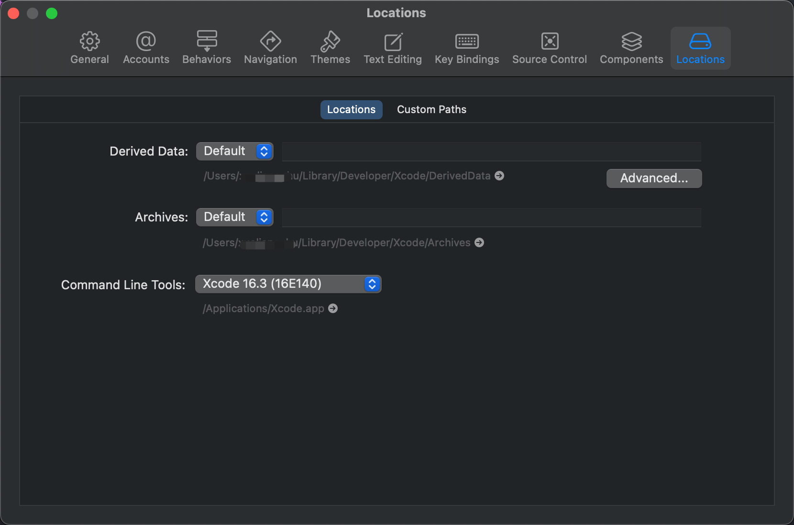
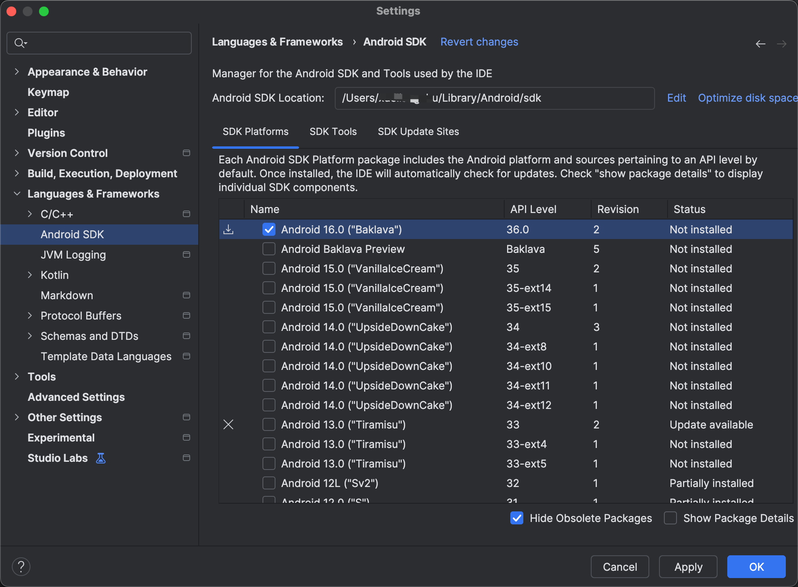
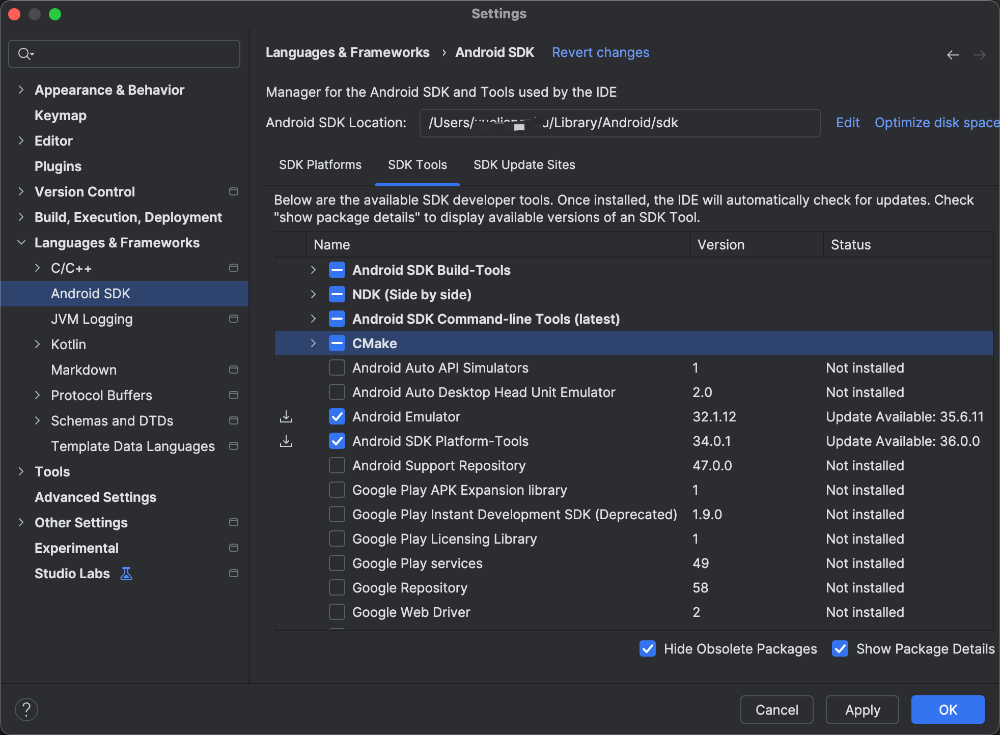
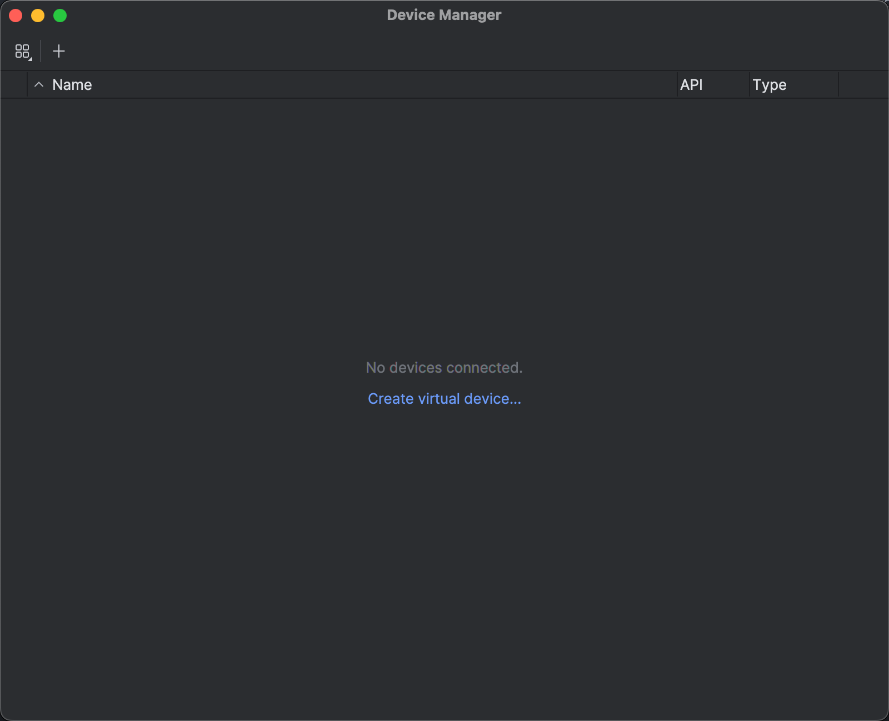
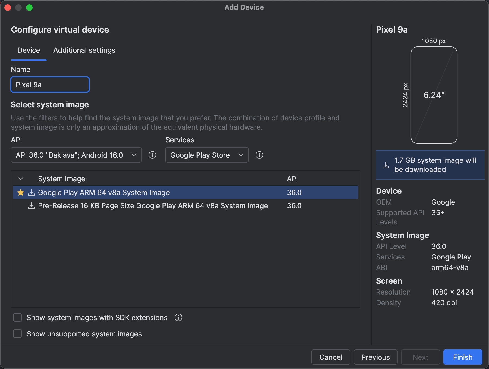

# Scaffold Stark React Native

<h4 align="center">
  <a href="https://docs.scaffoldstark.com/react-native">Documentation</a> |
  <a href="https://scaffoldstark.com/">Website</a>
</h4>

An open-source mobile toolkit for building decentralized applications (dApps) on Starknet. The React Native counterpart to [Scaffold Stark 2](https://github.com/Scaffold-Stark/scaffold-stark-2) — same developer experience, built for iOS and Android.

Built using **Expo**, **starknet.js**, **Scarb**, **Starknet Foundry**, and **NativeWind (TailwindCSS)**.

- **Contract Fast Reload** — Your app auto-adapts to your smart contracts as you deploy them.
- **Custom Hooks** — Type-safe React hooks for reading, writing, and subscribing to Starknet contracts, mirroring the Scaffold Stark 2 web hooks.
- **Debug Contracts Screen** — Inspect and interact with every function on your deployed contracts directly from the app.
- **Wallet-as-a-Service** — Seamless onboarding with [Cavos Aegis](https://services.cavos.xyz/dashboard) for Sepolia and Mainnet.
- **Burner Wallet** — Instant devnet testing without external wallet setup.
- **NativeWind Styling** — Write TailwindCSS classes in React Native via [NativeWind](https://www.nativewind.dev/).

## How It Compares to Scaffold Stark 2 (Web)

| Feature | Scaffold Stark 2 (Web) | Scaffold Stark RN (Mobile) |
|---------|----------------------|---------------------------|
| Framework | Next.js | Expo (React Native) |
| Styling | TailwindCSS | NativeWind (TailwindCSS) |
| Wallet Connection | Browser wallets (Argent, Braavos) | Cavos Aegis (WaaS) + Burner |
| Hook API | `useScaffoldReadContract`, etc. | Identical API signatures |
| Contract Debugging | `/debug` page | Debug tab in-app |
| Smart Contracts | Scarb + Starknet Foundry | Same (shared `snfoundry` workspace) |
| Deployment | Vercel / static hosting | App Store / Play Store via EAS |
| Scaffolder CLI | `npx create-stark@latest` | `npx create-stark-rn@latest` |

The smart contract workspace (`packages/snfoundry`) is shared — if you've used Scaffold Stark 2 before, the contract development workflow is identical.

---

## Prerequisites

### Required Software

| Tool | Version | Purpose |
|------|---------|---------|
| [Node.js](https://nodejs.org/) | >= v24 | Runtime (recommend [nvm](https://github.com/nvm-sh/nvm)) |
| [Yarn](https://yarnpkg.com/) | v3+ (or [v1 classic](https://classic.yarnpkg.com/)) | Package manager |
| [Git](https://git-scm.com/) | Latest | Version control |

### Starknet Developer Tools

| Tool | Version | Purpose |
|------|---------|---------|
| [Scarb](https://docs.swmansion.com/scarb/) | 2.16.0 | Cairo package manager and build toolchain |
| [Starknet Foundry](https://foundry-rs.github.io/starknet-foundry/) | 0.57.0 | Testing and deployment toolchain |
| [Starknet Devnet](https://0xspaceshard.github.io/starknet-devnet/) | 0.7.2 | Local Starknet node |
| [asdf](https://asdf-vm.com/) | Latest | Version manager for the above tools |

Install all Starknet tools at once with [starkup](https://github.com/software-mansion/starkup):

```sh
curl --proto '=https' --tlsv1.2 -sSf https://sh.starkup.sh | sh
```

Then pin the exact versions this project requires:

```sh
asdf install
```

This reads `.tool-versions` in the repo root and installs the correct Scarb, Starknet Foundry, and Devnet versions.

<details>
<summary>Manual version pinning (if asdf install doesn't work)</summary>

```sh
# Scarb
asdf install scarb 2.16.0 && asdf set scarb 2.16.0

# Starknet Foundry
asdf install starknet-foundry 0.57.0 && asdf set starknet-foundry 0.57.0

# Starknet Devnet
asdf install starknet-devnet 0.7.2 && asdf set starknet-devnet 0.7.2
```

Verify:

```sh
scarb --version          # 2.16.0
snforge --version        # 0.57.0
starknet-devnet --version # 0.7.2
```

</details>

### Mobile Development Setup

You need at least one of the following to run the app:

#### iOS (macOS only)

1. Install **Xcode** from the Mac App Store.
2. Install Xcode Command Line Tools: Xcode > Settings > Locations > Command Line Tools (select the most recent version in the dropdown).

   

3. Install an iOS Simulator: Xcode > Settings > Components > iOS.
4. Install [Watchman](https://facebook.github.io/watchman/):
   ```sh
   brew update && brew install watchman
   ```

#### Android

1. Install [Android Studio](https://developer.android.com/studio).
2. In Android Studio, go to Settings > Languages & Frameworks > Android SDK. From the **SDK Platforms** tab, select the latest Android version (API level).

   

   Then click the **SDK Tools** tab and make sure you have at least one version of the Android SDK Build-Tools and Android Emulator installed.

   

3. Add to your shell profile (`~/.zshrc` or `~/.bashrc`):
   ```sh
   export ANDROID_HOME=$HOME/Library/Android/sdk  # adjust for Linux
   export PATH=$PATH:$ANDROID_HOME/emulator
   export PATH=$PATH:$ANDROID_HOME/platform-tools
   ```
4. Reload your shell: `source ~/.zshrc`
5. Create a virtual device: Android Studio > Virtual Device Manager > Create Device.

   

   Choose a hardware profile (the newest Pixel is a good default):

   

#### Physical Device (optional)

Install [Expo Go](https://expo.dev/go) from the App Store or Google Play. When you start the dev server, scan the QR code with your camera (iOS) or Expo Go (Android).

---

## Installation

### Option 1: Create a new project (recommended)

```sh
npx create-stark-rn@latest
cd my-mobile-dapp
yarn install
```

### Option 2: Clone the repo

```sh
git clone https://github.com/Scaffold-Stark/scaffold-stark-rn.git
cd scaffold-stark-rn
yarn install
```

---

## Quick Start

Open **three terminal windows** and run:

**Terminal 1 — Start the local Starknet devnet:**

```sh
yarn chain
```

**Terminal 2 — Deploy the sample contracts:**

```sh
yarn deploy
```

**Terminal 3 — Launch the app:**

```sh
# iOS Simulator
yarn start:ios

# Android Emulator
yarn run start -- --android

# Or start the Expo dev server and choose from the menu
yarn start
```

The app connects to devnet by default. Edit files inside `packages/rn/app/` to start building — the project uses [file-based routing](https://docs.expo.dev/router/introduction).

---

## Recipes

### Read from a contract

```tsx
import { useScaffoldReadContract } from "@/hooks/scaffold-stark";

const { data, isLoading } = useScaffoldReadContract({
  contractName: "YourContract",
  functionName: "get_balance",
  args: ["0x123..."],
});
```

### Write to a contract

```tsx
import { useScaffoldWriteContract } from "@/hooks/scaffold-stark";

const { sendAsync, isLoading } = useScaffoldWriteContract({
  contractName: "YourContract",
  functionName: "transfer",
  args: [recipientAddress, amount],
});

// Call it from a button press
<Button title="Transfer" onPress={() => sendAsync()} disabled={isLoading} />
```

### Batch multiple writes

```tsx
import { useScaffoldMultiWriteContract } from "@/hooks/scaffold-stark";

const { sendAsync } = useScaffoldMultiWriteContract({
  calls: [
    { contractName: "Token", functionName: "approve", args: [spender, amount] },
    { contractName: "Vault", functionName: "deposit", args: [amount] },
  ],
});
```

### Get deployed contract info

```tsx
import { useDeployedContractInfo } from "@/hooks/scaffold-stark";

const { data, status } = useDeployedContractInfo("YourContract");
// status: "LOADING" | "DEPLOYED" | "NOT_FOUND"
// data?.address, data?.abi
```

### Check STRK balance

```tsx
import { useScaffoldStrkBalance } from "@/hooks/scaffold-stark";

const { value, formatted, isLoading } = useScaffoldStrkBalance({
  address: "0x123...",
});
```

### Listen to contract events

```tsx
import { useScaffoldEventHistory } from "@/hooks/scaffold-stark";

const { data: events, isLoading } = useScaffoldEventHistory({
  contractName: "YourContract",
  eventName: "Transfer",
  fromBlock: 0n,
});
```

---

## Environment Variables

Copy the example env files and fill in your values:

```sh
# Automatically copied on yarn install for snfoundry
# For the RN app:
cp packages/rn/.env.example packages/rn/.env
```

### React Native app (`packages/rn/.env`)

| Variable | Description |
|----------|-------------|
| `EXPO_PUBLIC_AEGIS_APP_ID` | Your [Cavos Aegis](https://services.cavos.xyz/dashboard) app ID for Sepolia/Mainnet wallets |
| `EXPO_PUBLIC_AVNU_API_KEY` | [AVNU](https://www.avnu.fi/) API key for gasless transaction sponsoring |

### Smart contracts (`packages/snfoundry/.env`)

| Variable | Description |
|----------|-------------|
| `PRIVATE_KEY_SEPOLIA` | Deployer private key for Sepolia testnet |
| `ACCOUNT_ADDRESS_SEPOLIA` | Deployer account address for Sepolia |
| `RPC_URL_SEPOLIA` | Sepolia RPC endpoint |
| `PRIVATE_KEY_MAINNET` | Deployer private key for Mainnet |
| `ACCOUNT_ADDRESS_MAINNET` | Deployer account address for Mainnet |
| `RPC_URL_MAINNET` | Mainnet RPC endpoint |

After updating `.env` files, restart the dev server so Expo picks up the new values.

---

## Available Scripts

| Command | Description |
|---------|-------------|
| `yarn install` | Install all dependencies |
| `yarn chain` | Start local Starknet devnet (seed 0) |
| `yarn deploy` | Compile and deploy contracts to devnet |
| `yarn deploy:clear` | Clear previous deployments and redeploy |
| `yarn start` | Start Expo dev server |
| `yarn start:ios` | Start Expo and open iOS Simulator |
| `yarn compile` | Compile Cairo contracts |
| `yarn test` | Run smart contract tests (snforge) |
| `yarn test:rn` | Run React Native unit tests (Jest) |
| `yarn format` | Format all code (Prettier + Scarb) |

---

## Project Structure

```
scaffold-stark-rn/
  packages/
    rn/                    # React Native (Expo) app
      app/                 # File-based routes (Expo Router)
        (tabs)/            # Tab navigator screens
      hooks/scaffold-stark # Contract interaction hooks
      utils/scaffold-stark # Utilities and helpers
      components/          # Reusable UI components
    snfoundry/             # Smart contracts workspace
      contracts/           # Cairo contracts
      scripts-ts/          # Deployment scripts
      deployments/         # Generated deployment artifacts
```

---

## Deploying to App Store / Play Store

See [SUBMIT.md](./SUBMIT.md) for the full guide on building and submitting with [EAS Build](https://docs.expo.dev/build/introduction/) and [EAS Submit](https://docs.expo.dev/submit/introduction/).

---

## Documentation

Full documentation — including hook references, mobile-specific considerations, and more recipes — is available at:

**[docs.scaffoldstark.com/react-native](https://docs.scaffoldstark.com/react-native)**

---

## Contributing

We welcome contributions. Please open an issue or pull request on [GitHub](https://github.com/Scaffold-Stark/scaffold-stark-rn).

## License

MIT
